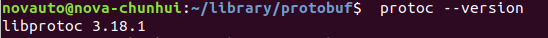

# Google Protobuf --python

## 参考资料：

[Google Protobuf简明教程——简书](https://www.jianshu.com/p/b723053a86a6)

[google protobuf官方文档](https://developers.google.com/protocol-buffers/docs/proto)

[protobuf github](https://github.com/protocolbuffers/protobuf)

## 安装：

python：

```csharp
pip install protobuf    # 安装protobuf库
sudo apt-get install protobuf-compiler  # 安装protobuf编译器
```

## 使用方法：

使用Protobuf有如下几个步骤：

1. 定义消息
2. 初始化消息以及存储传输消息
3. 读取消息并解析

下面以一个实际的例子来说明如何使用Protobuf，先展示出项目的实际目录结构：

```
|----------my        #此文件夹通过protoc命令编译生成的
|        |-----------helloworld_pb2.py   #此文件夹通过protoc命令编译生成的
|        |-----------helloworld_pb2.pyc
|        |-----------__init__.py   #是python包的标示，手动在这个包my下面，新建一个__init__.py空文件，不加就找不到这个my这个包
|----------mybuffer.io
|----------my.helloworld.proto  #此文件要通过protoc命令进行编译
|----------reader.py
|----------writer.py
```

### 定义消息

Protobuf的消息结构是通过一种叫做**Protocol Buffer Language**的语言进行定义和描述的，实际上**Protocol Buffer Language**分为两个版本，版本2和版本3，默认不声明的情况下使用的是版本2，下面以版本2为来举个栗子, 假设我们定义了文件名为my.helloworld.proto的文件，如下：

```go
syntax = "proto2";    #指定proto的版本为2
package my;     # 通过protoc编译后的文件夹为my
message helloworld
{
    required int32 id = 1;
    required string str = 2;
    optional int32 wow = 3;
}
```

然后我们需要在命令行中使用protoc（proto+compile）进行编译

```undefined
protoc -I=./ --python_out=./ ./my.helloworld.proto
# 通过这个命令会在本级目录生成/my/helloworld_pb2.py

在my文件加中新建一个"__init__.py”空文件（是python包的标识），这样才能运行python文件的时候找到这个包
```


- I:是设定源路径，在本级目录下则指定的源路径为"./"

- --python_out:用于设定编译后的输出结果路径，当前目录为"./"   如果使用其他语言请使用对应语言的option
- 最后一个参数是你要编译的proto文件

### 消息初始化和存储传输

我们通过writer.py来初始化消息并存储为文件，代码如下：

```python
from my.helloworld_pb2 import helloworld

def main():
    hw = helloworld()
    hw.id = 123
    hw.str = "eric"
    print(hw)
    
    with open("mybuffer.io","wb") as f:
        f.write(hw.SerializeToString())
        
if __name__=="__main__":
    main()
```

执行writer.py之后就会将序列化的结果存储在文件mybuffer.io中，

```
python3 writer.py   #用Python2不行
```

然后看下如何读取

### 消息读取与解析

我们通过reader.py来读取和解析消息，代码如下：

```python
from my.helloworld_pb2 import helloworld

def main():
    hw = helloworld();
    with open("mybuffer.io","rb") as f:
        hw.ParseFromString(f.read())
        print(hw.id)
        print(hw.str)
        
if __name__=="__main__":
    main()
```


## 常见问题：

问题1：[protobuf 编译proto文件报错：No syntax specified for the proto file](https://blog.csdn.net/guangyacyb/article/details/104051903):

在proto文件最开头加上：

<code> syntax="proto2;"</code>

或者

<code> syntax="proto3;"</code>

根据用的proto版本添加

# Google Protobuf --c++

##  参考资料：

[google protobuf (c++) 学习--csdn](https://blog.csdn.net/u013457167/article/details/91889611)

## 安装：

参考[官方README文档](https://github.com/protocolbuffers/protobuf/blob/master/src/README.md)进行安装

前提：

```
 sudo apt-get install autoconf automake libtool curl make g++ unzip
```

安装步骤：

```
git clone https://github.com/protocolbuffers/protobuf.git
cd protobuf/
git submodule update --init --recursive
./autogen.sh
./configure
make
make check   //如果Makefile里有check的话，会执行测试，也就是检查下编译出来的东西能不能 用
sudo make install
sudo ldconfig    // ldconfig是一个动态链接库管理命令，目的为了让动态链接库为系统所共享，搜索/usr/lib和/lib文件夹，搜索出可共享的动态链接库，进而创建动态装入程序(ld.so)所需的连接和缓存文件
ldconfig通常在系统启动时运行，而当用户安装了一个新的动态链接库时，就需要手动运行这个命令。
```

默认安装在/usr/local下面，可以进行查看库文件

```
pkg-config --cflags protobuf         # print compiler flags
pkg-config --libs protobuf           # print linker flags
pkg-config --cflags --libs protobuf  # print both
```

> pkg-config命令：pkg-config能够把这些头文件和库文件的位置找出来。
>
> --cflags参数：可以给出在编译时所需要的选项，(头文件相关)
>
> --libs参数：可以给出连接时的选项,(动态链接库相关)
>
> [详解pkg-config --cflags --libs glib-2.0的作用]: https://blog.csdn.net/shenwansangz/article/details/48738677
>
> 


查看安装版本：

```
 protoc --version
```



## 官方examples代码编译测试

参考[官方examples](https://github.com/protocolbuffers/protobuf/tree/master/examples)

通常，编写一个protocol buffers应用需要经历如下三步：

> 1.定义消息格式文件，最后以proto作为后缀名
>
> 2.使用Google提供的protocol buffers编译器来生成代码文件，一般为.h和.cc文件，主要是对消息格式以特定的语言方式描述
>
> 3.使用protocol buffers库提供的API来编写应用程序

首先编写addressbook.proto文件

```
syntax = "proto3";
package turtorial;

import "google/protobuf/timestamp.proto";

option java_package = "com.example.turtorial";
option java_outer_classname = "AddressBookProtos";

option csharp_namespace = "Google.Protobuf.Examples.AddressBook";

message Person {
    string name = 1;
    int32 id = 2;
    string email = 3;

    enum PhoneType {
        MOBILE = 0;
        HOME = 1;
        WORK = 2;
    }

    message PhoneNumber {
        string number = 1;
        PhoneType type =2;
    }

    repeated PhoneNumber phones = 4;
    google.protobuf.Timestamp last_updated = 5;
}

message AddressBook {
    repeated Person people = 1;
}
```

之后对其进行编译，产生对应的xxx.pb.cc和xxx.pb.h文件,如下图所示：

```cmd
protoc -I=./ --cpp_out=./ addressbook.proto
```


最后，

1.编写add_person.cc文件，该应用程序实现控制台输入person的相关信息并写入到文本文件：

```cpp
#include <ctime>
#include <fstream>
#include <google/protobuf/util/time_util.h>
#include <iostream>
#include <string>

#include "addressbook.pb.h"

using namespace std;
using google::protobuf::util::TimeUtil;

// 功能：通过用户输入来填充Person message内容
void PromptForAddress(turtorial::Person *person)
{
    cout << "Enter person ID number: ";
    int id;
    cin >> id;
    person->set_id(id);
    cin.ignore(256, '\n');

    cout << "Enter name: ";
    getline(cin, *person->mutable_name());

    cout << "Enter email address (blank for none): ";
    string email;
    getline(cin, email);
    if (!email.empty())
    {
        person->set_email(email);
    }

    while (true)
    {
        cout << "Enter a phone number (or leave blank to finish): ";
        string number;
        getline(cin, number);
        if (number.empty())
        {
            break;
        }

        turtorial::Person::PhoneNumber *phone_number = person->add_phones();
        phone_number->set_number(number);

        cout << "Is this a mobile , home,or work phone? ";
        string type;
        getline(cin, type);
        if (type == "mobile")
        {
            phone_number->set_type(turtorial::Person::MOBILE);
        }
        else if (type == "home")
        {
            phone_number->set_type(turtorial::Person::HOME);
        }
        else if (type == "work")
        {
            phone_number->set_type(turtorial::Person::WORK)
        }
        else
        {
            cout << "Unknown phone type, Using default. " << endl;
        }
    }
    *person->mutable_last_updated() = TimeUtil::SecondsToTimestamp(time(NULL));
}

int main(int argc, char* argv[])
{
    GOOGLE_PROTOBUF_VERIFY_VERSION;  //验证我们链接的库版本是否与我们编译的头文件版本兼容。

    if(argc !=2)
    {
        cerr << "Usage: " << argv[0] << " ADDRESS_BOOK_FILE" << endl;
        return -1;
    }

    turtorial::AddressBook address_book;
    {
        // 读取现存的address book
        fstream input(argv[1], ios::in | ios::binary);
        if(!input)
        {
            cout << argv[1] << "; File not found. Creating a new file." << endl;
        }
        else if(!address_book.ParseFromIstream(&input))
        {
            cerr << "Failed to parse address book." << endl;
            return -1;
        }
    }

    //添加一个address
    PromptForAddress(address_book.add_people());

    {
        // 写入新address book到硬盘上
        fstream output(argv[1],ios::out | ios::trunc | ios::binary);
        //ios::trunc模式打开文件，是以append的方式写入文件，不对文件清空
        if(!address_book.SerializeToOstream(&output))
        {
            cerr << "Failed to write address book." << endl;
            return -1;
        }
    }

    //可选的，删除libprotobuf分配的所有全局对象
    google::protobuf::ShutdownProtobufLibrary();

    return 0;
}
```

2.编写list_people.cc文件，该应用程序实现将add_person.cc写入的文本文件进行可视化读取

```cpp
#include <fstream>
#include <google/protobuf/util/time_util.h>
#include <iostream>
#include <string>

#include "addressbook.pb.h"

using namespace std;
using google::protobuf::util::TimeUtil;

//在AddressBook里迭代所有的people，并把他们的信息打印出来
void ListPeople(const turtorial::AddressBook &address_book)
{
    for (int i = 0; i < address_book.people_size(); i++)
    {
        const turtorial::Person &person = address_book.people(i);

        cout << "Person ID: " << person.id() << endl;
        cout << "Name: " << person.name() << endl;
        if (person.email() != "")
        {
            cout << "  E-mail address: " << person.email() << endl;
        }

        for (int j = 0; j < person.phones_size(); j++)
        {
            const turtorial::Person::PhoneNumber &phone_number = person.phones(j);

            switch (phone_number.type())
            {
            case turtorial::Person::MOBILE:
                cout << "Mobile phoe #: ";
                break;
            case turtorial::Person::HOME:
                cout << " Home phone #: ";
                break;
            case turtorial::Person::WORK:
                cout << "Work phone #: ";
                break;
            default:
                cout << "Unkown phone #: ";
                break;
            }
            cout << phone_number.number() << endl;
        }
        if (person.has_last_updated())
        {
            cout << "Updated: " << TimeUtil::ToString(person.last_updated()) << endl;
        }
    }
}

// Main函数：从一个文件里读取整个address book，并把里面所有的信息打印出来
int main(int argc, char *argv[])
{
    GOOGLE_PROTOBUF_VERIFY_VERSION; //验证我们链接的库版本是否与我们编译的头文件版本兼容。

    if (argc != 2)
    {
        cerr << "Usage: " << argv[0] << " ADDRESS_BOOK_FILE" << endl;
        return -1;
    }

    turtorial::AddressBook address_book;
    {
        //读取该address book。
        fstream input(argv[1], ios::in | ios::binary);
        if (!address_book.ParseFromIstream(&input))
        {
            cerr << "Failed to parse address book." << endl;
            return -1;
        }
    }

    ListPeople(address_book);

    //可选的，删除libprotobuf分配的所有全局对象
    google::protobuf::ShutdownProtobufLibrary();

    return 0;
}
```

分别进行编译，产生对应的可执行文件

```cmd
g++ add_person.cc addressbook.pb.cc -I/usr/local/include -L/usr/local/lib -lprotobuf -o add_person_cpp
g++ list_people.cc addressbook.pb.cc -I/usr/local/include -L/usr/local/lib -lprotobuf -o list_person_cpp
```

> 编译命令中的用到了“-I”、“-L”、“-l”，可以通过pkg-config --cflags --libs xxx命令来获取xxx(在这里是protobuf库)相关的头文件和库文件目录
>
> "-I"：指定头文件搜索目录
>
> “-L”：指定库文件路径
>
> -l：指定库名

分别运行

```cmd
./add_person_cpp address_book_file
./list_people_cpp address_book_file
```

下图中红色框内是第二次输入和输出的结果，我发现上次输入到address_book_file里的信息也打印出来的，看来输入信息时是以append的方式写入的，不是以cover的形式覆盖的。


